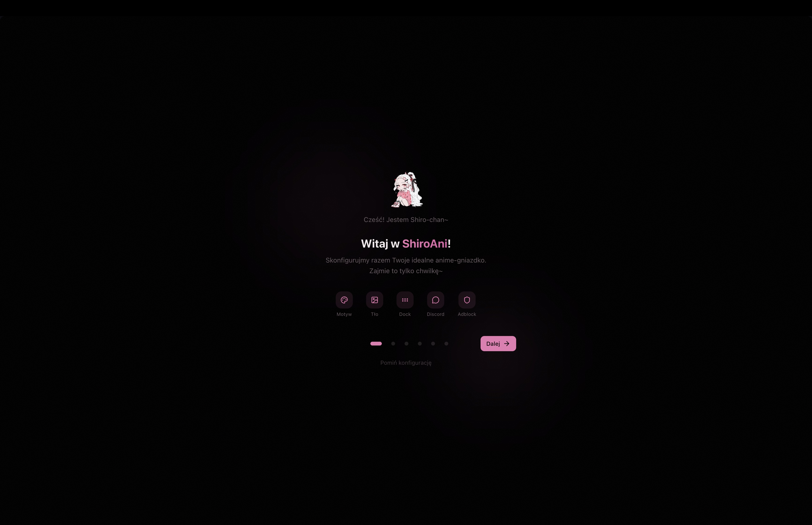
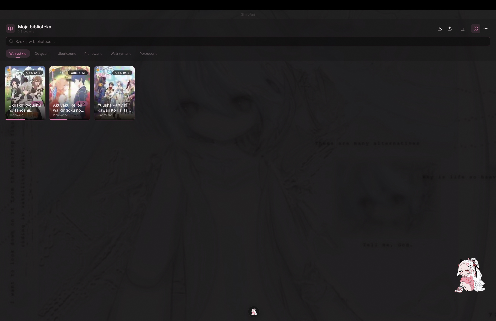
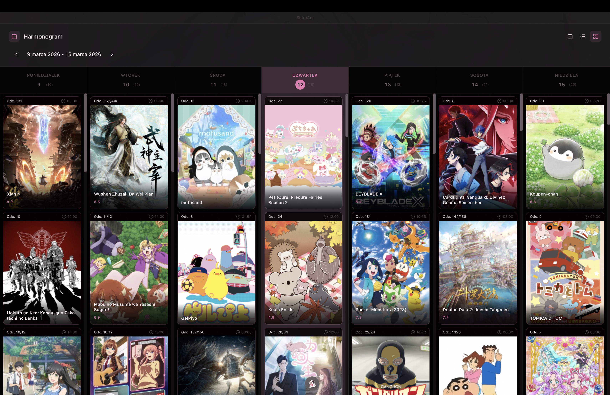
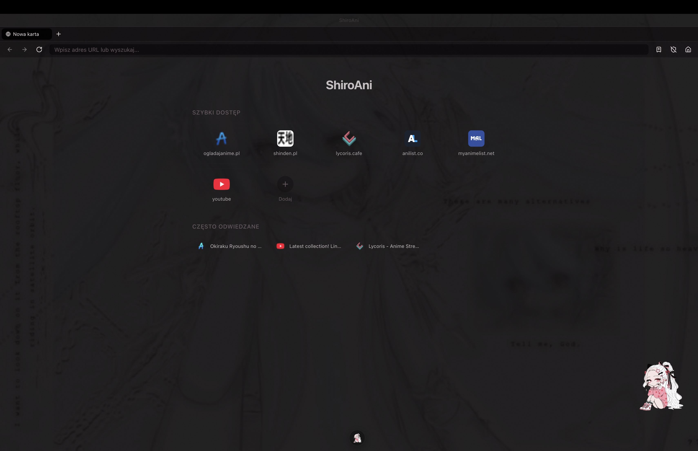
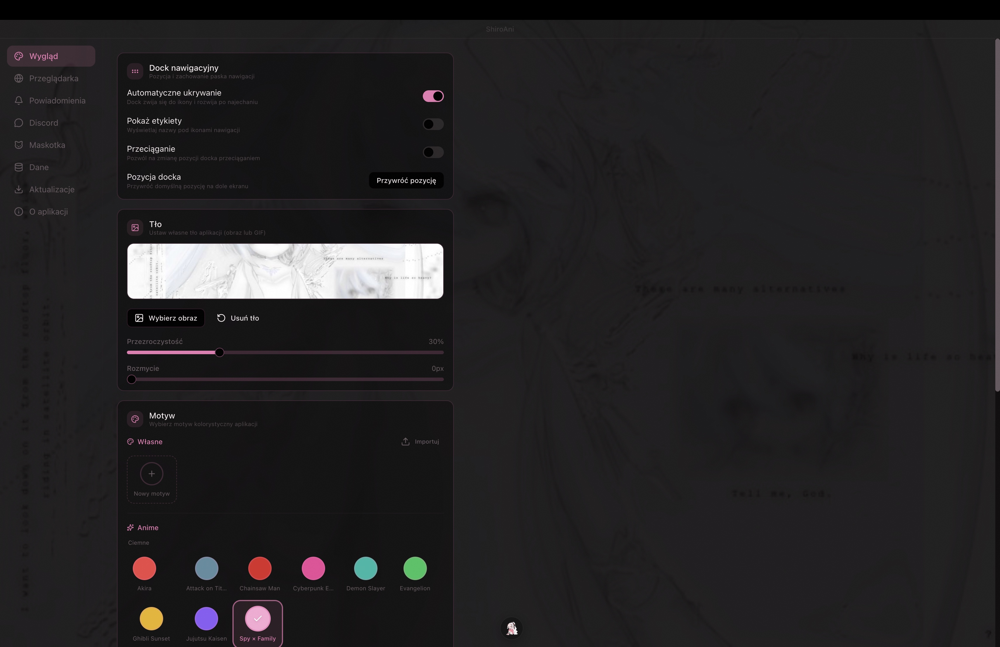

<a name="top"></a>

<div align="center">
  

  <h1>白アニ &nbsp;·&nbsp; ShiroAni</h1>

  <p><strong>Your cozy little corner for all things anime.</strong></p>

  <p>
    <a href="https://github.com/Shironex/shiroani/releases/latest">
      
    </a>
    <a href="https://github.com/Shironex/shiroani/releases">
      
    </a>
    
    <a href="LICENSE">
      
    </a>
  </p>

  <p>
    <a href="https://github.com/Shironex/shiroani/releases/latest"><strong>Download</strong></a>
  </p>

  <p>
    <a href="#english">English</a> · <a href="#polski">Polski</a>
  </p>

  <blockquote>
    <p>Shiro-chan is still growing up! The app is in early development — some things might be rough around the edges, but new stuff lands with every release.</p>
  </blockquote>
</div>

---

<a name="english"></a>

<details open>
<summary><h2>English</h2></summary>

### What is ShiroAni?

ShiroAni is a desktop app that brings everything anime into one place — browse and watch with a built-in ad-free browser, keep track of what you're watching, check airing schedules, write in your personal diary, and hang out with a little chibi companion on your desktop. All wrapped in a cozy, themeable UI that feels like home.

> **Heads up:** The interface is currently in Polish. English is on the way!

### Screenshots

<p align="center">
  
  <br />
  <em>Shiro-chan greets you while the app wakes up~</em>
</p>

<p align="center">
  
  <br />
  <em>First launch? Shiro-chan walks you through setting up your anime nest</em>
</p>

<p align="center">
  
  <br />
  <em>Your personal anime library — track everything you're watching</em>
</p>

<p align="center">
  
  <br />
  <em>Weekly airing schedule so you never miss a new episode</em>
</p>

<p align="center">
  
  <br />
  <em>Quick access to your favorite anime sites, right from new tab</em>
</p>

<p align="center">
  
  <br />
  <em>Themes, backgrounds, dock — make it feel like yours</em>
</p>

### What's inside

|                           |                                                                            |
| ------------------------- | -------------------------------------------------------------------------- |
| **Built-in Browser**      | Watch anime without ads — powered by Ghostery's ad-blocker                 |
| **Your Anime Library**    | Track everything: watching, completed, plan to watch, on hold, dropped     |
| **Airing Schedule**       | Never miss a new episode — weekly, daily, and timetable views from AniList |
| **Diary**                 | A personal journal with a rich text editor, just for you                   |
| **Desktop Mascot**        | A chibi companion who lives on your desktop with poses and animations      |
| **39 Themes**             | Including 15 anime-inspired ones, plus a visual editor to create your own  |
| **Custom Backgrounds**    | Make it yours with your favorite wallpapers                                |
| **Discord Rich Presence** | Show your friends what you're watching with customizable templates         |
| **Quick Access**          | Favorite anime sites one click away on new tabs                            |
| **Floating Dock**         | A sleek floating dock for navigating the app                               |
| **Episode Notifications** | Get notified when new episodes drop                                        |
| **Import / Export**       | Back up and restore your library and diary anytime                         |
| **Auto Updates**          | Stays up-to-date automatically on Windows                                  |

### Getting started

Grab the latest version for your system from [Releases](https://github.com/Shironex/shiroani/releases/latest).

#### Windows

1. Download the `.exe` installer.
2. Run it — Windows might show a SmartScreen warning since the app isn't code-signed. Click **"More info"** then **"Run anyway"**.
3. That's it! Future updates install automatically.

#### macOS

1. Download the `.dmg` file.
2. Open it and drag ShiroAni to your Applications folder.
3. macOS will block it because it's not code-signed. Open Terminal and run:
   ```bash
   xattr -cr /Applications/ShiroAni.app
   ```
4. Auto-updates aren't available on macOS yet, so grab new versions manually from [Releases](https://github.com/Shironex/shiroani/releases).

#### Linux

Coming soon!

### Built with

|           |                                              |
| --------- | -------------------------------------------- |
| Desktop   | Electron 40                                  |
| Backend   | NestJS 10 (embedded)                         |
| Frontend  | React 18, Vite 7, Tailwind CSS 4             |
| Database  | better-sqlite3                               |
| Rich Text | TipTap                                       |
| UI        | Radix UI, Lucide Icons                       |
| Real-time | Socket.IO                                    |
| State     | Zustand                                      |
| Native    | C++ overlay module (node-addon-api, Windows) |
| Quality   | ESLint, Prettier, Husky                      |
| Tests     | Jest, Vitest                                 |
| CI/CD     | GitHub Actions                               |

### Building from source

You'll need:

- [Node.js](https://nodejs.org/) >= 22
- [pnpm](https://pnpm.io/) >= 10
- A C++ compiler (Xcode CLI tools on macOS, Visual Studio Build Tools on Windows)

```bash
git clone https://github.com/Shironex/shiroani.git
cd shiroani
pnpm install
pnpm dev
```

<details>
<summary>All commands</summary>

```bash
pnpm dev           # Development mode
pnpm dev:debug     # Debug mode with verbose logging
pnpm lint          # Run linter
pnpm format        # Format code
pnpm format:check  # Check formatting
pnpm typecheck     # Type check
pnpm test          # Run tests
pnpm build         # Build the app
pnpm package:win   # Package for Windows
pnpm package:mac   # Package for macOS
```

</details>

### Project structure

```
shiroani/
├── apps/
│   ├── desktop/          # Electron + NestJS backend
│   └── web/              # React + Vite frontend
├── packages/
│   └── shared/           # Shared types, constants, utilities
├── scripts/              # Build and version scripts
├── docs/                 # Documentation
└── assets/               # Logo, screenshots
```

</details>

---

<a name="polski"></a>

<details>
<summary><h2>Polski</h2></summary>

### Czym jest ShiroAni?

ShiroAni to aplikacja desktopowa, która zbiera wszystko co anime w jednym miejscu — przeglądaj i oglądaj z wbudowaną przeglądarką bez reklam, śledź co oglądasz, sprawdzaj harmonogramy emisji, pisz w osobistym pamiętniku i spędzaj czas z małą chibi towarzyszką na pulpicie. Wszystko w przytulnym, konfigurowalnym interfejsie, który czuje się jak dom.

### Zrzuty ekranu

<p align="center">
  
  <br />
  <em>Shiro-chan wita Cię, gdy aplikacja się budzi~</em>
</p>

<p align="center">
  
  <br />
  <em>Pierwszy raz? Shiro-chan pomoże Ci urządzić Twoje anime-gniazdko</em>
</p>

<p align="center">
  
  <br />
  <em>Twoja osobista biblioteka anime — wszystko w jednym miejscu</em>
</p>

<p align="center">
  
  <br />
  <em>Tygodniowy harmonogram, żeby nie przegapić żadnego odcinka</em>
</p>

<p align="center">
  
  <br />
  <em>Szybki dostęp do ulubionych stron anime, prosto z nowej karty</em>
</p>

<p align="center">
  
  <br />
  <em>Motywy, tła, dock — dopasuj wszystko do siebie</em>
</p>

### Co znajdziesz w środku

|                               |                                                                                |
| ----------------------------- | ------------------------------------------------------------------------------ |
| **Wbudowana przeglądarka**    | Oglądaj anime bez reklam — blokowanie przez Ghostery                           |
| **Biblioteka anime**          | Śledź wszystko: oglądane, ukończone, planowane, wstrzymane, porzucone          |
| **Harmonogram emisji**        | Nigdy nie przegap odcinka — widok tygodniowy, dzienny i tabelaryczny z AniList |
| **Pamiętnik**                 | Osobisty dziennik z edytorem tekstu, tylko dla Ciebie                          |
| **Maskotka na pulpicie**      | Chibi towarzyszka z różnymi pozami i animacjami                                |
| **39 motywów**                | W tym 15 inspirowanych anime, plus wizualny edytor do tworzenia własnych       |
| **Własne tła**                | Spersonalizuj aplikację swoimi ulubionymi tapetami                             |
| **Discord Rich Presence**     | Pokaż znajomym co oglądasz z konfigurowalnymi szablonami                       |
| **Szybki dostęp**             | Ulubione strony anime jednym kliknięciem na nowej karcie                       |
| **Pływający dock**            | Elegancki pływający dock do nawigacji                                          |
| **Powiadomienia**             | Dostaniesz znać, gdy wyjdzie nowy odcinek                                      |
| **Import / Eksport**          | Twórz kopie zapasowe i przywracaj dane w każdej chwili                         |
| **Automatyczne aktualizacje** | Na Windowsie aktualizuje się sam                                               |

### Jak zacząć

Pobierz najnowszą wersję ze strony [Releases](https://github.com/Shironex/shiroani/releases/latest).

#### Windows

1. Pobierz instalator `.exe`.
2. Uruchom go — Windows może pokazać ostrzeżenie SmartScreen, bo aplikacja nie ma podpisu cyfrowego. Kliknij **"Więcej informacji"**, potem **"Uruchom mimo to"**.
3. Gotowe! Przyszłe aktualizacje zainstalują się same.

#### macOS

1. Pobierz plik `.dmg`.
2. Otwórz go i przeciągnij ShiroAni do folderu Aplikacje.
3. macOS zablokuje aplikację, bo nie ma podpisu cyfrowego. Otwórz Terminal i wpisz:
   ```bash
   xattr -cr /Applications/ShiroAni.app
   ```
4. Automatyczne aktualizacje na macOS nie są jeszcze dostępne — nowe wersje pobieraj ręcznie z [Releases](https://github.com/Shironex/shiroani/releases).

#### Linux

Już niedługo!

### Zbudowane z

|                      |                                     |
| -------------------- | ----------------------------------- |
| Aplikacja desktopowa | Electron 40                         |
| Backend              | NestJS 10 (wbudowany)               |
| Frontend             | React 18, Vite 7, Tailwind CSS 4    |
| Baza danych          | better-sqlite3                      |
| Edytor tekstu        | TipTap                              |
| UI                   | Radix UI, Lucide Icons              |
| Komunikacja          | Socket.IO                           |
| Stan                 | Zustand                             |
| Moduł natywny        | C++ (node-addon-api, tylko Windows) |
| Jakość kodu          | ESLint, Prettier, Husky             |
| Testy                | Jest, Vitest                        |
| CI/CD                | GitHub Actions                      |

### Budowanie ze źródeł

Będziesz potrzebować:

- [Node.js](https://nodejs.org/) >= 22
- [pnpm](https://pnpm.io/) >= 10
- Kompilator C++ (Xcode CLI tools na macOS, Visual Studio Build Tools na Windows)

```bash
git clone https://github.com/Shironex/shiroani.git
cd shiroani
pnpm install
pnpm dev
```

<details>
<summary>Wszystkie komendy</summary>

```bash
pnpm dev           # Tryb deweloperski
pnpm dev:debug     # Tryb debug z rozszerzonym logowaniem
pnpm lint          # Uruchom linter
pnpm format        # Formatuj kod
pnpm format:check  # Sprawdź formatowanie
pnpm typecheck     # Sprawdź typy
pnpm test          # Uruchom testy
pnpm build         # Zbuduj aplikację
pnpm package:win   # Spakuj na Windows
pnpm package:mac   # Spakuj na macOS
```

</details>

### Struktura projektu

```
shiroani/
├── apps/
│   ├── desktop/          # Electron + NestJS backend
│   └── web/              # React + Vite frontend
├── packages/
│   └── shared/           # Współdzielone typy, stałe, narzędzia
├── scripts/              # Skrypty do budowania i wersjonowania
├── docs/                 # Dokumentacja
└── assets/               # Logo, zrzuty ekranu
```

</details>

---

## License / Licencja

This project is source-available — see the [LICENSE](LICENSE) file for details. You're free to use the app and explore the code, but redistribution, reselling, and derivative works are not permitted.

Ten projekt jest udostępniony jako source-available — szczegóły w pliku [LICENSE](LICENSE). Możesz swobodnie korzystać z aplikacji i przeglądać kod, ale redystrybucja, odsprzedaż i tworzenie prac pochodnych są zabronione.

---

<p align="center">
  Made with &#10084; by <a href="https://github.com/Shironex">Shironex</a>
</p>

[Back to top](#top)
