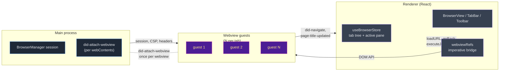

# Split-Tabs Feasibility — Built-in Browser

**Date:** 2026-04-27
**Agent:** kirei-arch
**Scope:** Drag-tab-onto-tab to create a side-by-side split view inside the embedded browser, gated behind a settings toggle. Advisory only — no code changes.

---

## TL;DR

**Feasibility: YES, cleanly — but only if you commit to a tree-shaped tab model.** The current architecture is tab-flat (one `<webview>` per `BrowserTab`, registered by `tabId` in a global `Map`). Almost every consumer in the renderer assumes "active tab = one URL = one webview" — `BrowserToolbar`, `useWebviewEvents`, `updateAnimePresence`, address bar sync, the keyboard shortcuts in `BrowserView`, `AddToLibraryDialog`, the persistence shape in `electronStoreSet('browser-tabs')`, and the tests. None of those callers are wrong; they're just written for a flat model.

The good news:

- Main process is **untouched**. `BrowserManager` (`apps/desktop/src/main/browser/browser-manager.ts`) is per-session, not per-tab. Two webviews in one tab share `persist:browser` exactly like two webviews in two tabs do today. No IPC changes, no CSP changes, no `will-attach-webview` changes.
- `webviewRefs` is already keyed by an opaque string ID, not by tab — this naming is fortunate; refs can be keyed by _pane_ ID without breaking any consumer if you migrate the keys.
- Tab-strip DnD already uses `@dnd-kit/core` + `@dnd-kit/sortable`. The library natively supports drop-on-item collision detection — no library swap needed.
- `react-resizable-panels` is **not installed** (verified against `apps/web/package.json` — no entry in deps; not in pnpm-lock either). It needs to be added plus the shadcn `resizable` block (not present in `apps/web/src/components/ui/`).

The cost:

- The `BrowserTab` type and the `tabs: BrowserTab[]` shape are load-bearing across roughly a dozen files (see "Tab model impact" below). Refactoring is medium-large, mostly mechanical.
- Webview-inside-resizable-panel has a known repaint quirk in Chromium that needs a defensive workaround (covered in "Risks").

**Bottom line:** This is a real feature, not a hack. If scoped to MVP (split + unsplit + setting gate, no nested splits, horizontal only, no per-pane history persistence), it's M-L on the renderer side with **zero** main-process work.

---

## 1. Current Architecture (relevant subset)

### Module map

| Layer                    | File                                                                                                 | Role                                                                                                                                           |
| ------------------------ | ---------------------------------------------------------------------------------------------------- | ---------------------------------------------------------------------------------------------------------------------------------------------- |
| Main: session            | `apps/desktop/src/main/browser/browser-manager.ts`                                                   | `persist:browser` session, adblock, whitelist, header rewrites — **per-session, never per-tab**                                                |
| Main: window             | `apps/desktop/src/main/window.ts:162`                                                                | `will-attach-webview` hardens preferences for every webview, regardless of tab                                                                 |
| Main: IPC                | `apps/desktop/src/main/ipc/browser.ts:160`                                                           | `did-attach-webview` registers `setWindowOpenHandler` + `before-input-event` per webContents — **already per-webview, not per-tab**            |
| Renderer: state          | `apps/web/src/stores/useBrowserStore.ts`                                                             | Source of truth: `tabs: BrowserTab[]`, `activeTabId`, persistence, navigation actions                                                          |
| Renderer: type           | `packages/shared/src/types/anime.ts:177`                                                             | `BrowserTab = { id, url, title, favicon?, isLoading, canGoBack, canGoForward }`                                                                |
| Renderer: ref registry   | `apps/web/src/components/browser/webviewRefs.ts`                                                     | `Map<string, WebviewElement>` keyed by `tabId`                                                                                                 |
| Renderer: layout         | `apps/web/src/components/browser/BrowserView.tsx`                                                    | Renders tab strip, toolbar, and one `<BrowserWebview>` per tab (CSS visibility, not unmount)                                                   |
| Renderer: webview        | `apps/web/src/components/browser/BrowserWebview.tsx`                                                 | The `<webview>` DOM element                                                                                                                    |
| Renderer: events         | `apps/web/src/hooks/useWebviewEvents.ts`                                                             | `did-navigate`, `page-title-updated`, `did-stop-loading`, fullscreen, etc. — calls `updateTabState(tabId, …)` and `updateAnimePresence(tabId)` |
| Renderer: tab strip      | `apps/web/src/components/browser/BrowserTabBar.tsx`                                                  | `@dnd-kit/sortable` horizontal strip with `PointerSensor(distance: 5)` and a `DragOverlay`                                                     |
| Renderer: toolbar        | `apps/web/src/components/browser/BrowserToolbar.tsx`                                                 | Address bar, back/forward/reload, add-to-library, home — reads `activeTab.url`, calls `useBrowserStore` actions                                |
| Renderer: settings UI    | `apps/web/src/components/settings/BrowserSection.tsx`                                                | Where the new "split view" toggle would live                                                                                                   |
| Renderer: settings store | `apps/web/src/stores/useSettingsStore.ts` (and `useBrowserStore` itself for browser-scoped settings) | Persists to `electron-store` via `electronStoreGet/Set`                                                                                        |
| Renderer: detection      | `apps/web/src/lib/anime-detection.ts:120`                                                            | `updateAnimePresence(tabId)` — gates Discord RPC + the local `animeWatchSeconds` counter on a single active tab                                |

### Critical assumptions baked in today

1. **One `BrowserTab` ↔ one `<webview>` ↔ one URL ↔ one history.**
   - `BrowserTab.url`, `.title`, `.favicon`, `.isLoading`, `.canGoBack`, `.canGoForward` are all single-valued (`packages/shared/src/types/anime.ts:177`).
2. **`activeTabId: string | null`** is the global "what is the user looking at" — used by `navigate`, `goBack`, `goForward`, `reload`, the address bar, anime detection, and Add-to-Library.
3. **`webviewRefs` is keyed by `tabId`.** Every imperative call (`getWebview(activeTabId)?.loadURL(...)`) would target the wrong (or only) webview if a tab had two.
4. **`updateAnimePresence(tabId)` reads from the tab's single `url`/`title`** — it does not know about panes.
5. **Persistence shape** (`useBrowserStore.persistTabs` line 296) is `Array<{ url, title }>` — no room for split state, and silently lossy if a split is open.
6. **`BrowserView` keyboard shortcuts** (`Ctrl+W`, `Ctrl+R`, `Alt+ArrowLeft`, etc.) all act on `activeTabId` with no concept of "which pane has focus".

None of these are bugs. They are simplifying assumptions that the split feature has to either (a) keep, by making "split" a layer above tabs, or (b) replace, by promoting the tab to a tree.

---

## 2. Tab Model Impact

### The two viable shapes — pick one

#### Option A: Tab tree (`BrowserTab` becomes `BrowserNode`)

```ts
type BrowserNode =
  | {
      kind: 'leaf';
      id: string;
      url: string;
      title: string;
      favicon?: string;
      isLoading: boolean;
      canGoBack: boolean;
      canGoForward: boolean;
    }
  | {
      kind: 'split';
      id: string;
      orientation: 'horizontal' | 'vertical';
      ratio: number /* 0..1 */;
      left: BrowserNode;
      right: BrowserNode;
    };

interface BrowserState {
  tabs: BrowserNode[]; // top-level only
  activeTabId: string; // top-level node id (the strip uses this)
  activePaneId: string; // leaf id within the active tab (focus tracking)
  // …
}
```

**Pros**

- Conceptually clean. A "tab" is a pane; a "split tab" is a tab that is a split of two panes. Recursion comes for free if you ever want 4-way split.
- Address bar / back / forward / reload naturally bind to `activePaneId`, not `activeTabId`.
- `webviewRefs` switches from `Map<tabId, …>` to `Map<paneId, …>` — leaf id = pane id. Same `Map`, renamed semantics.
- Tab strip iterates `tabs[]` and renders one chip per top-level node, regardless of leaf/split — a split tab gets one chip with a small "split" indicator.

**Cons**

- Touches every file that destructures `tab.url` or `tab.title` from a `BrowserTab` directly.
- Tab-strip favicon/title for a split tab needs a derivation rule (use the active pane's, or show two stacked mini-favicons).
- Persistence shape grows; needs a forward-compatible migration that ignores leaf-only tabs the same way as today.

#### Option B: Flat tabs + sidecar `splitGroups: Map<tabId, [leftPaneId, rightPaneId]>`

Keep `BrowserTab` exactly as today, plus pane records keyed independently. A "split tab" is an opaque flat tab whose `url` is unused; the pane URLs live elsewhere.

**Pros**

- Minimal blast radius for the type. Existing `tabs.find(t => t.id === activeTabId)` keeps working for the **tab strip** without changes.

**Cons**

- Two sources of truth for what a tab "is." `tab.url` becomes a lie for split tabs. Every consumer of `activeTab.url` (toolbar, anime detection, Add-to-Library) has to first ask "is this tab split? if so, which pane is focused?" — the same logic as Option A, but spread across more code paths.
- Forces a runtime "is this tab split?" check at every consumer. Type-system can't help.
- `unsplit` becomes a 3-way state mutation: pop sidecar, promote one pane back into the flat tab, create a new flat tab from the other.
- Future-hostile: if you ever want nested splits or 3+ panes you've painted yourself into a corner.

### Recommendation

**Option A.** The blast radius isn't actually that bad — it's mostly mechanical. The type system catches every site that needs touching. Option B looks cheaper but distributes the cost across consumers and tests, and it traps you.

### Files that change for Option A

| File                                                     | Change                                                                                                                                                                                                                                                                       | Effort |
| -------------------------------------------------------- | ---------------------------------------------------------------------------------------------------------------------------------------------------------------------------------------------------------------------------------------------------------------------------- | ------ |
| `packages/shared/src/types/anime.ts`                     | Add `BrowserNode` discriminated union; keep `BrowserTab` as alias of `LeafNode` for back-compat at the boundary                                                                                                                                                              | S      |
| `apps/web/src/stores/useBrowserStore.ts`                 | `tabs: BrowserNode[]`, add `activePaneId`, rewrite `closeTab`/`navigate`/`goBack`/`goForward`/`reload` to walk the tree to find the focused leaf; add `splitTabs(sourceTabId, targetTabId)`, `unsplitTab(splitNodeId)`, `setSplitRatio(splitId, ratio)`, `focusPane(paneId)` | L      |
| `apps/web/src/components/browser/BrowserView.tsx`        | Replace `tabs.map(tab => <BrowserWebview>)` with a recursive renderer (leaves render webviews, splits render `<ResizablePanelGroup>`)                                                                                                                                        | M      |
| `apps/web/src/components/browser/BrowserTabBar.tsx`      | Add drop-on-tab detection (separate from drop-between-tabs); show split indicator on split tabs                                                                                                                                                                              | M      |
| `apps/web/src/components/browser/BrowserWebview.tsx`     | No change to the element itself, but now mounted inside a `<ResizablePanel>`                                                                                                                                                                                                 | XS     |
| `apps/web/src/components/browser/BrowserToolbar.tsx`     | Read from `activePane`, not `activeTab`                                                                                                                                                                                                                                      | S      |
| `apps/web/src/components/browser/webviewRefs.ts`         | Rename "tabId" → "paneId" in docs/types; storage unchanged                                                                                                                                                                                                                   | XS     |
| `apps/web/src/hooks/useWebviewEvents.ts`                 | Receives `paneId` (was `tabId`) — rename + update `updateTabState` callsites to update the leaf                                                                                                                                                                              | S      |
| `apps/web/src/lib/anime-detection.ts`                    | `updateAnimePresence(paneId)` — read URL from active pane, not active tab                                                                                                                                                                                                    | S      |
| `apps/web/src/components/browser/AddToLibraryDialog.tsx` | Read URL/title from active pane                                                                                                                                                                                                                                              | XS     |
| `apps/web/src/stores/__tests__/useBrowserStore.test.ts`  | Tests assume `tabs[0].url` etc. — every assertion needs `expectLeaf(tabs[0])` style helpers, plus new tests for split/unsplit                                                                                                                                                | M      |

---

## 3. Webview Lifecycle Concerns

Each one needs a concrete answer, not just a flag.

### Focus management (which pane is "active")

Add `activePaneId: string` to the store. A leaf tab's `activePaneId === tab.id`. A split tab's `activePaneId` is one of the two child leaves. Click a pane → `focusPane(paneId)` updates `activePaneId`. The pane chrome gets a 1-px primary-tinted ring on the focused pane (consistent with the Plum theme glass tokens already in use).

This **cannot** be derived from `document.activeElement` because the focused element will be inside the webview's isolated frame; the renderer can't see it. Track it explicitly on click + on `did-navigate`.

### Active tab tracking + Discord RPC

`updateAnimePresence` currently takes `tabId` and reads `tabs.find(t => t.id === tabId).url`. Two changes:

1. The function should take `paneId`, not `tabId`. The leaf is what has a URL.
2. The "is this the active surface?" gate currently checks `tabId !== _activeTabId || _activeView !== 'browser'`. With splits it becomes `paneId !== _activePaneId || _activeView !== 'browser'` — only the _focused pane_ drives RPC. The unfocused pane in the same split tab should NOT update presence even though it's visible. This matches user intent: "the show I'm watching" is whichever pane I'm interacting with, not whichever loaded last.

There is one edge case: a user splits Crunchyroll-on-the-left + Wikipedia-on-the-right, watches the anime, but clicks Wikipedia to scroll. RPC will flip from "watching X" to "browsing wikipedia.org." That's the correct, defensible behavior — fighting it would mean RPC ping-pongs, which is worse.

### Address bar — which webview is "addressed"?

The toolbar reflects the **focused pane**. Type a URL, hit Enter → loads in the focused pane. This is what every other split-view browser (Vivaldi, Arc) does and what the user will expect. Implementation: `BrowserToolbar` reads `activePane.url`/`canGoBack`/`isLoading`; `navigate(url)` calls `getWebview(activePaneId)?.loadURL(url)`.

### Reload / Back / Forward — per-pane or per-tab?

**Per-pane.** They act on the focused pane only. The Ctrl+R / Alt+Left shortcuts route through the same `activePaneId`. There is no useful definition of "reload both panes," and "reload tab" means nothing if a tab has two URLs.

### Keyboard shortcuts (`BrowserView` lines 42-92)

- `Ctrl+W`: close the **focused pane**. If the focused pane is the only leaf in the tab, close the whole tab. If the focused pane is one of two in a split, that's an implicit unsplit (the surviving pane becomes a regular leaf tab in place).
- `Ctrl+T`: open new tab — unchanged.
- `Ctrl+Tab`: cycles top-level tabs — unchanged. (Cycling between panes inside a split tab is a separate shortcut you may want later, e.g. `Ctrl+Alt+ArrowRight`. Out of scope for MVP.)
- `Ctrl+L`: focus address bar — unchanged.
- `Ctrl+R`, `Alt+ArrowLeft`, `Alt+ArrowRight`: route through `activePaneId` — pure substitution.

### Add to Library Dialog

Currently `<AddToLibraryDialog url={activeTab?.url} title={activeTab?.title} />` and the dialog calls `getWebview(activeTabId)?.executeJavaScript(...)`. Both switch to `activePane`/`activePaneId`. No structural change, just renames.

### `did-attach-webview` and main-process per-webview wiring

`apps/desktop/src/main/ipc/browser.ts:160` already attaches `setWindowOpenHandler` and `before-input-event` to every newly-attached webContents. **It does not know or care about tabs.** A second webview in the same tab gets the same wiring automatically. No main-process changes needed for split.

The only subtle thing: `browser:new-window-request` IPC currently calls `useBrowserStore.getState().openTab(url)` — opening as a new top-level tab. That's the correct behavior even for window.open from a pane (you don't want a popup to take over a sibling pane). Leave it alone.

---

## 4. Drag-and-Drop Integration

### What's already there

`BrowserTabBar.tsx` uses `@dnd-kit/core` + `@dnd-kit/sortable` with:

- `PointerSensor` with `activationConstraint: { distance: 5 }`
- `closestCenter` collision detection
- `restrictToHorizontalAxis` modifier
- A `DragOverlay` showing the dragged tab as a chip
- `SortableContext` with `horizontalListSortingStrategy`
- `handleDragEnd` calls `onReorderTabs(active.id, over.id)` whenever `over.id !== active.id` — this currently means "swap positions"

### How to extend

The clean way is **modifier keys**, the friendly way is **drop zones on each tab**.

**Recommended hybrid:**

1. Switch the per-tab `useSortable` droppable to expose two collision targets — one for "reorder before this tab" (the gap between tabs, or the tab edges) and one for "merge into this tab" (the tab body center). `@dnd-kit` supports this via custom `collisionDetection` returning the closer of two droppable IDs per tab. Pattern: each `SortableTab` registers itself plus a sibling `useDroppable({ id: \`merge-${tab.id}\` })` overlapping the inner 60% of the tab.
2. In `handleDragEnd`, branch on the `over.id`:
   - `tab.id` → `onReorderTabs(active, over)` (existing behavior)
   - `merge-${tab.id}` → `onSplitTabs(active, over)` (new)
3. Visual feedback: when a drag is active and hovering a merge zone, show a vertical line down the middle of the target tab + a `Columns2` (lucide) ghost icon to telegraph "drop = split."

This keeps existing reorder UX, requires no library swap, and degrades gracefully if the user just wants to reorder.

### Alternative: hold-to-split affordance

If the merge-zone-on-each-tab approach is too visually noisy, fall back to "hold the dragged tab over a target tab for ~400 ms" (single droppable per tab, distinguish reorder-vs-split by hover dwell). `@dnd-kit` doesn't have this built in but it's ~30 lines of state. Less discoverable; mention as a v2.

### Out of scope (call out as future work)

- Dragging a tab from the strip into the **content area** of an existing tab to create a split (Vivaldi-style). This requires a second `DndContext` or a global one and is much more complex. MVP = drop-on-strip-tab only.
- Dragging a pane out of a split to form its own tab (the inverse). Achievable later with the same merge-zone primitives, but unsplit-button covers 90% of the use case.

---

## 5. shadcn Resizable Panel Fit

### Installation status

- `react-resizable-panels` is **not** in `apps/web/package.json` (verified — checked deps and devDeps; not in pnpm-lock either).
- The shadcn `resizable.tsx` component is **not** in `apps/web/src/components/ui/` (verified — directory listing shows alert-dialog, badge, button, dialog, input, pill-tag, select, separator, skeleton, slider, sonner, spinner-ring, switch, tooltip-button, tooltip — no `resizable.tsx`).

Adding it: `pnpm --filter @shiroani/web add react-resizable-panels`, then drop in the shadcn block. The component itself is ~50 lines (PanelGroup / Panel / PanelResizeHandle wrappers with Tailwind classes for the drag handle). This is XS work.

### Webview-inside-resizable concerns

Yes, there are real concerns. Three known issues with `<webview>` + dynamic resize in Chromium:

1. **Repaint lag during drag.** Electron's webview is an out-of-process frame. While the user drags the splitter, the inner page may paint stale frames or stutter. Mitigation: throttle the `onLayout` from `react-resizable-panels` (it fires per frame) — the library already does this internally, but if you observe issues, debounce the persisted `ratio` write to the store with a 60ms trailing.
2. **Iframe / video player size.** Many anime players (the whole reason this app exists) measure their container on mount and don't re-layout on resize. Most modern players use ResizeObserver — fine. Older Flash/JW Player setups (rare on the target sites today) won't. Workaround: emit a synthetic `window.resize` into the webview after a drag ends, via `executeJavaScript('window.dispatchEvent(new Event("resize"))')`. Cheap and harmless.
3. **Pointer events lost mid-drag** if the divider passes over the webview. `react-resizable-panels` puts the drag handle as a sibling element, but pointer-events on a `<webview>` capture the cursor while it's over the guest content. Two known fixes: (a) `pointer-events: none` on the inactive webview during drag (toggle on `onDragStart`/`onDragEnd`), or (b) cover both panes with a transparent full-bleed overlay during drag. Approach (b) is more reliable; ~10 lines.

None of these are blockers. All three are well-known and well-trodden in Electron-side communities; flag them in the implementation TODO.

### Constraints

- Use **only horizontal split for MVP**. Vertical split has the same machinery but doubles the matrix of resize/repaint edge cases to test. Punt to v2.
- Default ratio: 0.5. Min size per panel: 20% (so a webview never collapses to nothing — chromium reflow on a near-zero-width frame is where the worst repaint bugs live).

---

## 6. Unsplit Button

### Where it lives

**Per-pane chrome strip**, not in the toolbar. The pane chrome is a thin (~22px) bar at the top of each pane in a split tab, containing:

- Optional truncated favicon + title (so the user sees which pane is which when neither is focused)
- An "unsplit" button (`Columns2` icon with a slash, or simpler: `X` icon labelled "Zamknij ten panel")

The toolbar stays at the tab level (one address bar, reflects focused pane).

A **secondary** entry point: right-click on a split tab in the strip → context menu item "Rozdziel karty" / "Połącz w jedną kartę". Out of scope for MVP — call it a follow-up. (Today the tab strip has no context menu at all; adding one is its own ticket.)

### What "unsplit back to two tabs" means

`unsplitTab(splitNodeId)` semantics:

1. Find the parent split node `S` with two child leaves `L`, `R`.
2. Replace `S` with the **focused leaf** (call it `keep`) at the same tab-strip position. The other leaf `evict` is promoted into a new top-level tab inserted **immediately to the right** of the kept tab.
3. Active tab stays on `keep`. `activePaneId = keep.id`.
4. webviewRefs entries for both leaves are preserved as-is (their `paneId`s do not change). Their webContents are not destroyed — they keep their navigation history, scroll position, audio state. Crucial: this is what makes unsplit feel non-destructive.
5. Persist tabs.

Tab order after unsplit: `[A, kept, evicted, B, C]` if the split tab was at index 1 between A and B. Predictable; matches what users do mentally ("oh, these were one tab, now they're two adjacent tabs").

### What if the user closes one pane (Ctrl+W on focused pane)?

Same as unsplit, except `evict` is destroyed (webview ref unregistered, leaf dropped) and `keep` is the unfocused pane that survives. In effect: `closeFocusedPane` → `unsplitTab(parentSplitId)` followed by drop-the-evicted-tab. Implementing it as a single store action is cleaner than chaining.

### Per-pane history

Each leaf has its own `<webview>` and therefore its own back/forward history. After unsplit, both panes-now-tabs retain their independent histories. Nothing to do — comes for free from the webview model.

---

## 7. Settings Gate

### Where the toggle lives

`apps/web/src/components/settings/BrowserSection.tsx`, in the existing "Zachowanie kart" `SettingsCard` (which already houses `restoreTabsOnStartup` and `trackFrequentSites`). Add a third row:

```tsx
<SettingsToggleRow
  id="browser-split-tabs-label"
  title="Karty dzielone"
  description="Przeciągnij kartę na drugą, żeby otworzyć je obok siebie."
  checked={splitTabsEnabled}
  onCheckedChange={setSplitTabsEnabled}
/>
```

### Where the state lives

Add to **`useBrowserStore`** (not `useSettingsStore`) — it's browser-scoped, lives next to `restoreTabsOnStartup`, and uses the same `persistBrowserSettings({ splitTabsEnabled })` helper that already merges into the `'browser-settings'` electron-store key. Pattern is already there; extend it.

```ts
// state
splitTabsEnabled: boolean; // default: true

// action
setSplitTabsEnabled: (enabled: boolean) => Promise<void>;
```

### Default value

**Default: `true`.** Reasoning: the feature is discoverable only via dragging a tab onto another. A user who never drags-on-drop will never see it, so leaving it on for everyone has zero cost and surfaces the feature for users who try the gesture exploratively. Off-by-default would mean nobody finds it.

Counter-argument: webview repaint quirks (Risk #2 below). If those land badly on macOS Apple Silicon you may want off-by-default until that's solid. **My recommendation: ship the gate, default to true, flip to false in patch release if telemetry-style bug reports indicate problems.**

### How tab strip + DnD branch on it

- `BrowserTabBar`: when `splitTabsEnabled === false`, do not register the inner "merge" droppable on each tab. Only the existing reorder droppable is active. Drag UX stays identical to today.
- `handleDragEnd`: when over a merge zone but `splitTabsEnabled === false`, fall through to reorder (or do nothing — but reorder is more predictable).
- `BrowserView`: the rendering tree handles split nodes regardless of the setting (a split tab that already exists when the user toggles off should keep working until they unsplit it; or, more user-friendly, **auto-unsplit all open splits when the toggle goes from true → false**). I'd ship auto-unsplit-on-disable for clarity.

---

## 8. Complexity Estimate

Broken into discrete, mergeable chunks. Each row is a separate PR.

| #   | Chunk                                                                                                                                                                                            | Effort | Dependencies | Notes                                                        |
| --- | ------------------------------------------------------------------------------------------------------------------------------------------------------------------------------------------------ | ------ | ------------ | ------------------------------------------------------------ |
| 1   | Install `react-resizable-panels` + add shadcn `resizable.tsx` block + a Storybook-ish demo page                                                                                                  | XS     | —            | Verify the divider styling matches Plum theme glass tokens   |
| 2   | `BrowserNode` discriminated union in `packages/shared`; back-compat `BrowserTab` alias for the leaf shape                                                                                        | S      | —            | Type-only; build will surface every site that needs touching |
| 3   | Refactor `useBrowserStore` to hold `BrowserNode[]`; introduce `activePaneId`; rewrite `closeTab`/`navigate`/`goBack`/`goForward`/`reload` to operate on the focused leaf; keep all tests passing | L      | #2           | Mostly mechanical; biggest single chunk                      |
| 4   | Refactor `BrowserView` to render the tree recursively (leaves → `<BrowserWebview>`, splits → `<ResizablePanelGroup>`)                                                                            | M      | #1, #3       | Includes the focused-pane visual ring                        |
| 5   | Update `useWebviewEvents`, `anime-detection`, `BrowserToolbar`, `AddToLibraryDialog` to use `activePaneId`                                                                                       | S      | #3           | Renames + plumbing                                           |
| 6   | Add merge-zone droppables to `BrowserTabBar`; wire `splitTabs` action; visual feedback during drag                                                                                               | M      | #3, #4       | The DnD UX work — most user-visible polish lives here        |
| 7   | Add per-pane chrome bar with unsplit button; wire `unsplitTab` action; handle Ctrl+W on focused pane                                                                                             | M      | #3, #4       | Includes the Polish strings — see "Risks"                    |
| 8   | Settings toggle: store field, persistence row, BrowserSection UI, branching in TabBar/View, auto-unsplit-on-disable                                                                              | S      | #3, #6, #7   |                                                              |
| 9   | Persistence shape migration: extend `'browser-tabs'` schema; forward-compat reader; round-trip tests                                                                                             | M      | #3, #8       | The danger zone — easy to lose tabs across versions          |
| 10  | Tests: store unit tests for split/unsplit/focus, integration test for drag-on-tab merge, restore-after-restart                                                                                   | M      | All          |                                                              |

**Totals:** 1×XS + 2×S + 1×S(toggle) + 4×M + 1×L = roughly **3-5 days of focused work** for a single experienced developer who knows the codebase, or 1.5-2 weeks calendar for a careful, well-reviewed rollout.

### Scoping options if the budget is tight

- **MVP (skip 9, 10 hardening):** Drop persistence-of-splits across restart — splits collapse to two adjacent tabs on app restart. Drop nested splits (already not in scope). Drop vertical split. This brings total to ~2-3 days.
- **Tracer bullet:** Just chunks 1, 2, 3, 4 with hard-coded "two tabs side-by-side, no DnD entry, just a debug button" — proves the webview-inside-resizable works on macOS and Windows before committing to the rest. ~1 day. Recommended first step before shaping the full feature.

---

## 9. Risks & Gotchas

1. **Webview repaint during resize (medium risk).** Covered in §5. Mitigation is known but real engineering. Spike chunk #1 specifically for this — if dragging the splitter on a YouTube/Crunchyroll page is janky on Apple Silicon, you've found a serious problem before you've spent the rest of the budget.

2. **Z-index / overlay during drag (medium risk).** `<webview>` consumes pointer events while the cursor is over the guest content. `react-resizable-panels` may lose grip on the splitter mid-drag. Solution: full-bleed transparent overlay div on `onDragStart`, removed on `onDragEnd` — captures pointer events back to the page. ~10 lines, must-do.

3. **Persistence migration (medium risk).** The current `'browser-tabs'` shape is `{ tabs: Array<{ url, title }>, activeIndex }`. Extending to a tree breaks forward-compat. Options: (a) version the key (`browser-tabs-v2`), (b) write both shapes during the transition release, (c) silently flatten splits to two adjacent leaves on read. **Recommend (c)** — splits are session-state, and "I split tabs, restarted, splits are now two regular tabs" is a non-confusing degradation. Don't try to persist split structure across restarts in MVP.

4. **Tab-strip UX collision (low risk).** Reorder vs. split-merge are both drop-on-tab gestures. The hit-testing has to be unambiguous. Internal 60% = merge, outer 20% on each side = reorder-before/after is the conventional split. Test with a trackpad — fine motor control matters here.

5. **Discord RPC ping-pong (low risk).** Switching focus between two panes in a split tab will fire `updateAnimePresence` rapidly. The Discord client rate-limits aggressively. Add a 500ms trailing debounce on `updateAnimePresence` (it doesn't have one today — `apps/web/src/lib/anime-detection.ts:120`). Cheap and worth doing regardless of split work.

6. **Accessibility (low risk).** Per-pane chrome needs `role="region" aria-label="Lewy panel" / "Prawy panel"`. Splitter handle needs `role="separator" aria-orientation="vertical" aria-valuenow="50"`. `react-resizable-panels` provides these — just verify after integration. Keyboard users with no pointing device cannot create splits via DnD; provide a keyboard alternative (e.g. context-menu item "Rozdziel z kartą po prawej") only if a11y is a stated constraint, otherwise document as a known limitation.

7. **Polish UI strings.** New strings needed (consistent with existing tone — short, sentence-case Polish):
   - `"Karty dzielone"` (setting title)
   - `"Przeciągnij kartę na drugą, żeby otworzyć je obok siebie."` (setting description)
   - `"Rozdziel"` (unsplit button label / tooltip)
   - `"Lewy panel"`, `"Prawy panel"` (a11y labels)
   - `"Upuść tutaj, aby otworzyć obok"` (drop-zone hint, optional)
     The existing strings use the casual second person (`"Twoje karty"`, `"Wpisz adres albo szukaj"`) — match that.

8. **DragOverlay portal collision.** The current `BrowserTabBar` uses `<DragOverlay>` which portals to the body. When a split-merge target lights up, the visual indicator must NOT be on the overlay (the user is dragging the overlay) — it must be on the static target tab. Easy to get backwards on first try.

9. **Unsplit + close-pane race.** If a webview crashes (`render-process-gone`) inside a split, the surviving pane should auto-unsplit. Today there's no per-tab handler for this — `apps/desktop/src/main/window.ts:267` logs but doesn't notify the renderer. Out of scope, but flag it as future hardening.

10. **`activePaneId` desync on close.** When closing the focused pane / tab, `activePaneId` must update to the next valid leaf in the same step as `tabs`. The current `closeTab` already does this for `activeTabId` — mirror the pattern carefully or you'll get a one-frame "no active pane" flash that breaks the toolbar.

---

## 10. Mermaid Diagrams

### Current architecture (flat)

```mermaid
flowchart TD
    subgraph main["Main Process (Electron)"]
        BM[BrowserManager<br/>persist:browser session]
        WIN[window.ts<br/>will-attach-webview]
        IPC[ipc/browser.ts<br/>did-attach-webview]
    end

    subgraph renderer["Renderer (React)"]
        STORE[useBrowserStore<br/>tabs: BrowserTab&#91;&#93;<br/>activeTabId]
        VIEW[BrowserView]
        BAR[BrowserTabBar<br/>dnd-kit sortable]
        TBAR[BrowserToolbar]
        WV[BrowserWebview x N]
        REFS[webviewRefs<br/>Map&lt;tabId, el&gt;]
        EVT[useWebviewEvents]
        DET[anime-detection<br/>updateAnimePresence&#40;tabId&#41;]
    end

    VIEW --> BAR
    VIEW --> TBAR
    VIEW --> WV
    BAR --> STORE
    TBAR --> STORE
    WV --> EVT
    EVT --> REFS
    EVT --> STORE
    EVT --> DET
    STORE --> REFS
    STORE --> DET

    WV -.attaches.-> IPC
    WV -.session.-> BM
    WIN -.hardens.-> WV
```



### Proposed model (tree with splits)

```mermaid
flowchart TD
    subgraph state["useBrowserStore"]
        TABS["tabs: BrowserNode&#91;&#93;"]
        AT[activeTabId]
        AP[activePaneId]
    end

    subgraph node["BrowserNode (discriminated union)"]
        LEAF["LeafNode<br/>id, url, title,<br/>favicon, isLoading,<br/>canGoBack, canGoForward"]
        SPLIT["SplitNode<br/>id, orientation,<br/>ratio, left, right"]
    end

    subgraph render["Render tree"]
        VIEW2[BrowserView]
        REC[renderNode&#40;node&#41;<br/>recursive]
        RPG[ResizablePanelGroup]
        RP[ResizablePanel]
        WV2[BrowserWebview<br/>per leaf]
    end

    subgraph reg["Pane registry"]
        REFS2["webviewRefs<br/>Map&lt;paneId, el&gt;<br/>(paneId === leaf.id)"]
    end

    TABS --> LEAF
    TABS --> SPLIT
    SPLIT --> LEAF
    SPLIT --> SPLIT

    VIEW2 --> REC
    REC -- "kind === leaf" --> WV2
    REC -- "kind === split" --> RPG
    RPG --> RP
    RP --> REC
    WV2 --> REFS2

    AP -.targets.-> WV2
    AT -.selects.-> TABS
```



### Ownership boundaries



The point of this diagram: the **main process boundary does not move** when you add splits. The renderer's pane registry already speaks in opaque IDs to the imperative DOM API; making those IDs pane-scoped instead of tab-scoped is a renaming, not a re-plumbing.

---

## What to Keep (don't refactor)

- `BrowserManager`. It's the right shape — per-session, not per-tab. Splits don't need to touch it.
- `did-attach-webview` wiring in `apps/desktop/src/main/ipc/browser.ts`. Already per-webContents, already correct for N webviews per tab.
- `webviewRefs` as a `Map`. Just rename the key semantics from "tabId" to "paneId" — same shape, same callers.
- The `@dnd-kit` setup in `BrowserTabBar`. Extend with a second droppable per tab; do not swap libraries.
- `useWebviewEvents`. Add `paneId` parameter, but the event-handling logic is solid.
- The persistence helper `persistBrowserSettings`. Add `splitTabsEnabled` to the merged shape; don't introduce a new electron-store key.

## What to Change

- `BrowserTab` type → `BrowserNode` discriminated union (leaf | split). Keep `BrowserTab` as a leaf alias during migration.
- `useBrowserStore.tabs: BrowserTab[]` → `tabs: BrowserNode[]` plus `activePaneId`.
- Every consumer that reads `activeTab.url` / `.title` reads from the active _pane_ (the leaf the user has focus on), not the active tab.
- `updateAnimePresence(tabId)` → `updateAnimePresence(paneId)`.
- Persistence schema (versioned or flatten-on-read).
- `BrowserView` rendering loop becomes recursive.
- `BrowserTabBar` adds inner-tab merge droppable.

## Migration Path (incremental)

1. Land chunk #2 (types) with `BrowserTab = LeafNode` alias — zero behavior change, surfaces compiler errors.
2. Land chunk #3 (store refactor) with all tabs forced to leaves — all existing tests still pass; no UI change.
3. Land chunk #1 (resizable installed) and chunk #4 (recursive render) behind a hard-coded `false` debug flag — proves the substrate works.
4. Land chunks #5, #6, #7, #8 together — the user-visible feature ships in one release behind the setting.
5. Land #9 (persistence) and #10 (tests) before promoting to default-on.

This sequence keeps each PR small enough to review and ensures `master` is shippable at every step.
